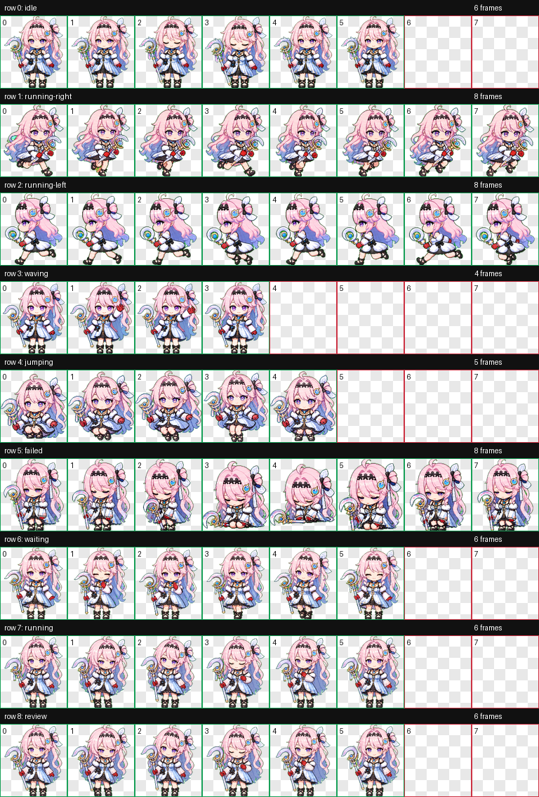

# Daniya Codex Pet

Daniya is a custom animated Codex pet packaged for the Codex desktop app.

The pet is a compact chibi sprite version of Daniya with pastel pink hair, blue accents, a star headband, a blue-white dress, red gloves, and a small crescent staff.



## Install

Copy the package folder into your Codex pets directory:

```powershell
Copy-Item -Recurse -Force .\pets\daniya "$env:USERPROFILE\.codex\pets\daniya"
```

Then restart Codex or reselect the pet in the avatar/pet picker.

The installed package should look like this:

```text
%USERPROFILE%\.codex\pets\daniya\
  pet.json
  spritesheet.webp
```

## Package

The installable pet files are in:

```text
pets/daniya/
```

`pet.json` points to `spritesheet.webp`, which uses the Codex fixed pet atlas contract:

| Property | Value |
| --- | --- |
| Format | WebP with transparency |
| Atlas size | 1536 x 1872 |
| Grid | 8 columns x 9 rows |
| Cell size | 192 x 208 |

## Animation Rows

| Row | State | Frames | Purpose |
| ---: | --- | ---: | --- |
| 0 | idle | 6 | Neutral breathing and blink loop |
| 1 | running-right | 8 | Rightward movement |
| 2 | running-left | 8 | Leftward movement |
| 3 | waving | 4 | Greeting gesture |
| 4 | jumping | 5 | Jump cycle |
| 5 | failed | 8 | Failed or blocked reaction |
| 6 | waiting | 6 | Waiting for input |
| 7 | running | 6 | Task-running state, edited to read closer to review/waiting |
| 8 | review | 6 | Focused review/ready state |

Preview videos are available in `qa/videos/`.

## Validation

The published spritesheet was validated with the `hatch-pet` atlas validator:

```text
ok: true
format: WEBP
mode: RGBA
width: 1536
height: 1872
errors: []
warnings: []
```

## Motion Note

Codex respects the operating system reduced-motion preference. If Windows has animation effects disabled, the app can display only the first frame of each pet state. Turn on:

```text
Settings > Accessibility > Visual effects > Animation effects
```

Then restart Codex if the pet appears frozen during task execution.
